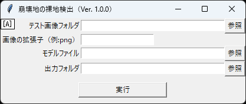

# 「崩壊地の裸地検出AI」と「テストデータの色調整」

このリポジトリには「崩壊地の裸地検出AI」と「テストデータの色調整」のソースコード（Python）とWindows用アプリ（EXEファイル）が含まれています。
Windows用アプリは、画面でフォルダやファイルを選択できるようになっています。したがって、Pythonの実行環境の構築が不要です。
ソースコードは色々と修正したい方のために公開しています。

# Window用アプリ
## 崩壊地の裸地検出AI
### ダウンロード
「AiModel_Grayslace.h5」をクリックします。
「Raw」をクリックするとAIモデルのダウンロードがはじまります。

次に、distフォルダの「崩壊地の裸地検出.exe」をクリックします。
AIモデルと同様に、「Raw」をクリックするとアプリのダウンロードがはじまります。

### 使い方
ダウンロードした「崩壊地の裸地検出.exe」をダブルクリックすると以下の画面が表示されます。

各項目を選択・入力して「実行」ボタンをクリックすると、AIによる検出が開始されます。
ここで「モデルファイル」は「AiModel_Grayslace.h5」を選択してください。

## テストデータの色調整
### ダウンロード
distフォルダの「色調整.exe」をクリックします。
「崩壊地の裸地検出.exe」のダウンロードと同様に、「Raw」をクリックするとアプリのダウンロードがはじまります。

### 使い方
ダウンロードした「色調整.exe」をダブルクリックすると以下の画面が表示されます。

各項目を選択・入力して「実行」ボタンをクリックすると、テストデータの色調整が開始されます。

# ライセンス
[MIT](https://github.com/tcnksm/tool/blob/master/LICENCE)

# Reference
[1]荒木光一、藤田達大、河村知記、藤原大佑、大丸裕武、戸田 堅一郎、村上 亘、'AIを用いた崩壊地検出におけるグレースケールの空中写真に対する色調整の検討'、日本地すべり学会 第64回研究発表会、pp.273-274、2025年9月

# 著者
五大開発株式会社　技術研究所　荒木光一