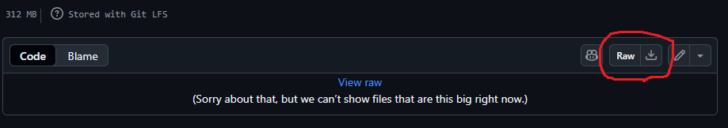

# 「崩壊地の裸地検出AI」と「テストデータの色調整」

このリポジトリには「崩壊地の裸地検出AI」と「テストデータの色調整」のソースコード（Python）とWindows用アプリ（EXEファイル）が含まれています。
Windows用アプリは、画面でフォルダやファイルを選択できるようになっています。したがって、Pythonの実行環境の構築が不要です。
ソースコードは色々と修正したい方のために公開しています。

# Window用アプリ
## 崩壊地の裸地検出AI
### ダウンロード
「AiModel_Grayslace.h5」をクリックします。
以下の画面にある「Raw」をクリックするとAIモデルのダウンロードがはじまります。

次に、distフォルダの「崩壊地の裸地検出.exe」をクリックします。
AIモデルと同様に、「Raw」をクリックするとアプリのダウンロードがはじまります。

### 使い方
ダウンロードした「崩壊地の裸地検出.exe」をダブルクリックすると以下の画面が表示されます。

各項目を選択・入力して「実行」ボタンをクリックすると、AIによる検出が開始されます。

ここで「モデルファイル」は「AiModel_Grayslace.h5」を選択してください。

## テストデータの色調整
### 使い方

崩壊地の裸地をU-Netで検出

